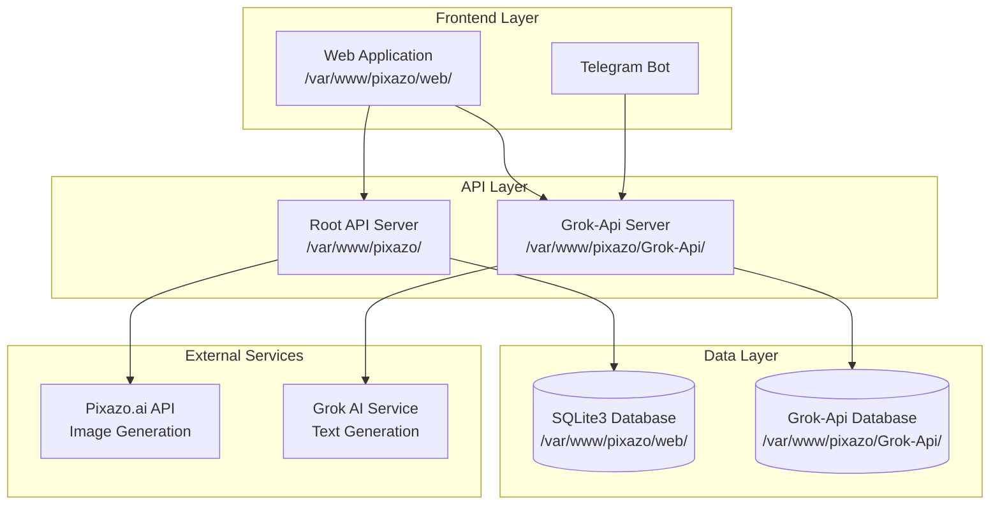
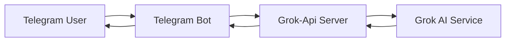

# Pixazo Project Roadmap

## Project Overview

Pixazo is a comprehensive AI-powered platform that combines multiple AI services into a unified interface for image generation, prompt enhancement, and text generation.

### Current State

**Root Project (`/var/www/pixazo/`)**:
- MCP tool server for using with any LLM (with Tools option)
- Free API of pixazo.ai API with three image generation models
- Web application in `/var/www/pixazo/web/` folder
- SQLite3 database
- Bootstrap Admin dark theme

**Grok-Api Subproject (`/var/www/pixazo/Grok-Api/`)**:
- OpenAI-compatible API wrapper for Grok AI service
- Supports both streaming and non-streaming responses
- API key authentication
- Multiple model support (grok-3-auto, grok-3-fast, grok-4, grok-4-mini-thinking-tahoe)

### Technology Stack

**Frontend**:
- Plain HTML/CSS/JavaScript (no server-side JS framework)
- Bootstrap Admin dark theme
- Desktop-first responsive design

**Backend**:
- Python FastAPI for API servers
- SQLite3 for database (current)
- MCP (Model Context Protocol) for LLM integration

**Image Generation Models**:
- Stable Diffusion (SD)
- Stable Diffusion XL (SDXL)
- Flux Klein
- All models are free to use

## System Architecture



## Phase 1: Web Application Foundation (Current Focus)

### 1.1 Database Schema Design

**Tables**:

```sql
-- Workspaces table
CREATE TABLE workspaces (
    id INTEGER PRIMARY KEY AUTOINCREMENT,
    name TEXT NOT NULL,
    description TEXT,
    model TEXT NOT NULL DEFAULT 'grok-3-auto',
    created_at TIMESTAMP DEFAULT CURRENT_TIMESTAMP,
    updated_at TIMESTAMP DEFAULT CURRENT_TIMESTAMP
);

-- Chats table
CREATE TABLE chats (
    id INTEGER PRIMARY KEY AUTOINCREMENT,
    workspace_id INTEGER NOT NULL,
    name TEXT NOT NULL,
    created_at TIMESTAMP DEFAULT CURRENT_TIMESTAMP,
    updated_at TIMESTAMP DEFAULT CURRENT_TIMESTAMP,
    FOREIGN KEY (workspace_id) REFERENCES workspaces(id) ON DELETE CASCADE
);

-- Messages table
CREATE TABLE messages (
    id INTEGER PRIMARY KEY AUTOINCREMENT,
    chat_id INTEGER NOT NULL,
    role TEXT NOT NULL CHECK (role IN ('user', 'assistant', 'system')),
    content TEXT NOT NULL,
    created_at TIMESTAMP DEFAULT CURRENT_TIMESTAMP,
    FOREIGN KEY (chat_id) REFERENCES chats(id) ON DELETE CASCADE
);

-- Images table
CREATE TABLE images (
    id INTEGER PRIMARY KEY AUTOINCREMENT,
    chat_id INTEGER NOT NULL,
    prompt TEXT NOT NULL,
    model TEXT NOT NULL,
    image_url TEXT NOT NULL,
    thumbnail_url TEXT,
    created_at TIMESTAMP DEFAULT CURRENT_TIMESTAMP,
    FOREIGN KEY (chat_id) REFERENCES chats(id) ON DELETE CASCADE
);

-- Prompts table (for saved prompts)
CREATE TABLE prompts (
    id INTEGER PRIMARY KEY AUTOINCREMENT,
    workspace_id INTEGER,
    title TEXT NOT NULL,
    content TEXT NOT NULL,
    tags TEXT,
    created_at TIMESTAMP DEFAULT CURRENT_TIMESTAMP,
    FOREIGN KEY (workspace_id) REFERENCES workspaces(id) ON DELETE SET NULL
);
```

### 1.2 Web Application Structure

```
/var/www/pixazo/web/
├── index.html              # Main application entry point
├── css/
│   ├── bootstrap.min.css  # Bootstrap Admin dark theme
│   ├── custom.css          # Custom styles
│   └── components.css     # Component-specific styles
├── js/
│   ├── app.js              # Main application logic
│   ├── api.js              # API communication
│   ├── workspace.js        # Workspace management
│   ├── chat.js             # Chat functionality
│   ├── gallery.js          # Image gallery
│   └── utils.js            # Utility functions
├── images/
│   ├── thumbnails/         # Generated image thumbnails
│   └── uploads/            # User uploaded images
└── data/
    └── pixazo.db          # SQLite3 database
```

### 1.3 Core Features

#### 1.3.1 Workspace Management
- **Create New Workspace**: Start a new workspace with clean LLM chat
- **Model Selection**: Choose between grok-3-auto, grok-3-fast, grok-4, grok-4-mini-thinking-tahoe
- **Workspace List**: View and manage all workspaces
- **Delete Workspace**: Remove workspace and all associated data

#### 1.3.2 Chat Functionality
- **New Chat**: Start a new chat within a workspace
- **Message History**: View conversation history
- **Streaming Responses**: Real-time streaming of AI responses
- **Model Switching**: Change model for current chat
- **Export Chat**: Export chat to JSON format
- **Import Chat**: Import chat from JSON format

#### 1.3.3 Image Generation
- **Prompt Enhancement**: Use Grok-Api to improve prompts
- **Model Selection**: Choose between SD, SDXL, Flux Klein
- **Generate Image**: Send prompt to pixazo.ai API
- **Image Gallery**: View last 20 generated images with thumbnails
- **Download Image**: Download generated images
- **Save Prompt**: Save prompts for later use

#### 1.3.4 Prompt Management
- **Save Prompt**: Save prompts with title and tags
- **Prompt Library**: View and manage saved prompts
- **Quick Insert**: Insert saved prompts into chat
- **Export Prompts**: Export prompts to JSON
- **Import Prompts**: Import prompts from JSON

## Phase 2: API Integration

### 2.1 Root API Server (`/var/www/pixazo/`)

**Endpoints**:

```python
# Workspace Management
GET    /api/workspaces              # List all workspaces
POST   /api/workspaces              # Create new workspace
GET    /api/workspaces/{id}         # Get workspace details
PUT    /api/workspaces/{id}         # Update workspace
DELETE /api/workspaces/{id}         # Delete workspace

# Chat Management
GET    /api/workspaces/{id}/chats   # List chats in workspace
POST   /api/workspaces/{id}/chats   # Create new chat
GET    /api/chats/{id}              # Get chat details
DELETE /api/chats/{id}              # Delete chat
GET    /api/chats/{id}/export       # Export chat to JSON
POST   /api/chats/{id}/import       # Import chat from JSON

# Message Management
GET    /api/chats/{id}/messages    # Get chat messages
POST   /api/chats/{id}/messages    # Send message
DELETE /api/chats/{id}/messages/{msg_id}  # Delete message

# Image Generation
POST   /api/images/generate        # Generate image
GET    /api/images                  # List images (last 20)
GET    /api/images/{id}             # Get image details
DELETE /api/images/{id}             # Delete image

# Prompt Management
GET    /api/prompts                 # List saved prompts
POST   /api/prompts                 # Save prompt
GET    /api/prompts/{id}            # Get prompt details
DELETE /api/prompts/{id}            # Delete prompt
```

### 2.2 Grok-Api Integration

**Usage**:
- **Prompt Enhancement**: Send user prompt to Grok-Api for improvement
- **Model Selection**: Use Grok-Api to recommend best model for image generation
- **Style Suggestions**: Get style suggestions for image generation

**Integration Points**:
```python
# Prompt Enhancement
POST /api/prompts/enhance
{
    "prompt": "A beautiful sunset over mountains",
    "model": "grok-3-auto"
}

# Model Recommendation
POST /api/images/recommend-model
{
    "prompt": "A beautiful sunset over mountains",
    "style": "realistic"
}
```

## Phase 3: Telegram Bot

### 3.1 Bot Architecture



### 3.2 Bot Features

#### 3.2.1 Basic Features
- **Text Generation**: Generate text using Grok AI
- **Model Selection**: Choose between different Grok models
- **Conversation History**: Maintain conversation context
- **User Profiles**: Store user preferences

#### 3.2.2 Advanced Features
- **Image Generation**: Generate images using pixazo.ai API
- **Prompt Enhancement**: Improve prompts using Grok-Api
- **Saved Prompts**: Save and reuse prompts
- **Export Conversations**: Export conversations to JSON

### 3.3 Bot Commands

```
/start - Start the bot and show help
/new - Start new conversation
/model - Select model (grok-3-auto, grok-3-fast, grok-4, grok-4-mini-thinking-tahoe)
/image - Generate image
/enhance - Enhance prompt
/save - Save current prompt
/prompts - List saved prompts
/export - Export conversation
/help - Show help message
```

### 3.4 Bot Technology Stack

- **Language**: Python
- **Framework**: python-telegram-bot (or aiogram)
- **Database**: SQLite3 (shared with web app)
- **API Integration**: Grok-Api for text generation

## Phase 4: Advanced Features

### 4.1 User Authentication
- **User Registration**: Register new users
- **Login/Logout**: User authentication
- **API Keys**: Manage API keys for different services
- **User Profiles**: Store user preferences and settings

### 4.2 Collaboration Features
- **Share Workspaces**: Share workspaces with other users
- **Collaborative Editing**: Multiple users editing same workspace
- **Comments**: Add comments to chats and images
- **Version History**: Track changes to workspaces

### 4.3 Analytics and Monitoring
- **Usage Statistics**: Track API usage and costs
- **Performance Metrics**: Monitor response times
- **Error Tracking**: Log and analyze errors
- **User Analytics**: Track user behavior and preferences

### 4.4 Advanced Image Features
- **Image Editing**: Edit generated images
- **Style Transfer**: Apply different styles to images
- **Batch Generation**: Generate multiple images at once
- **Image Comparison**: Compare different generated images

## Implementation Timeline

### Sprint 1: Foundation (Week 1-2)
- [ ] Set up project structure
- [ ] Design and implement database schema
- [ ] Create basic web application layout
- [ ] Implement workspace management
- [ ] Implement basic chat functionality

### Sprint 2: Core Features (Week 3-4)
- [ ] Implement message sending and receiving
- [ ] Add streaming support for responses
- [ ] Implement image generation
- [ ] Add image gallery with thumbnails
- [ ] Implement prompt enhancement

### Sprint 3: Advanced Features (Week 5-6)
- [ ] Implement chat export/import
- [ ] Add prompt management
- [ ] Implement model selection
- [ ] Add user authentication
- [ ] Implement API key management

### Sprint 4: Telegram Bot (Week 7-8)
- [ ] Set up Telegram bot
- [ ] Implement basic text generation
- [ ] Add model selection
- [ ] Implement conversation history
- [ ] Add image generation

### Sprint 5: Polish and Deploy (Week 9-10)
- [ ] Add error handling and logging
- [ ] Implement analytics and monitoring
- [ ] Performance optimization
- [ ] Security hardening
- [ ] Deployment and testing

## Technical Considerations

### Security
- **API Key Management**: Secure storage of API keys
- **User Authentication**: Secure user authentication
- **Input Validation**: Validate all user inputs
- **SQL Injection Prevention**: Use parameterized queries
- **XSS Prevention**: Sanitize user-generated content

### Performance
- **Caching**: Cache frequently accessed data
- **Database Optimization**: Optimize database queries
- **Image Optimization**: Optimize image sizes and formats
- **Lazy Loading**: Load images and data on demand
- **CDN**: Use CDN for static assets

### Scalability
- **Database Migration**: Plan for migration from SQLite to PostgreSQL
- **Load Balancing**: Plan for load balancing API servers
- **Horizontal Scaling**: Design for horizontal scaling
- **Microservices**: Consider microservices architecture for future growth

### Monitoring
- **Logging**: Comprehensive logging of all operations
- **Error Tracking**: Track and analyze errors
- **Performance Monitoring**: Monitor response times and resource usage
- **User Analytics**: Track user behavior and preferences

## Next Steps

1. **Review and Approve Roadmap**: Review this roadmap and provide feedback
2. **Set Up Development Environment**: Set up development environment with all required tools
3. **Start Sprint 1**: Begin implementation of Sprint 1 tasks
4. **Regular Reviews**: Conduct regular sprint reviews and retrospectives
5. **Iterate and Improve**: Continuously iterate and improve based on feedback

## Conclusion

This roadmap provides a comprehensive plan for building the Pixazo platform, starting with the web application foundation and progressing to advanced features and Telegram bot integration. The phased approach allows for iterative development and continuous improvement, ensuring that each phase builds upon the previous one and delivers value to users early in the process.
